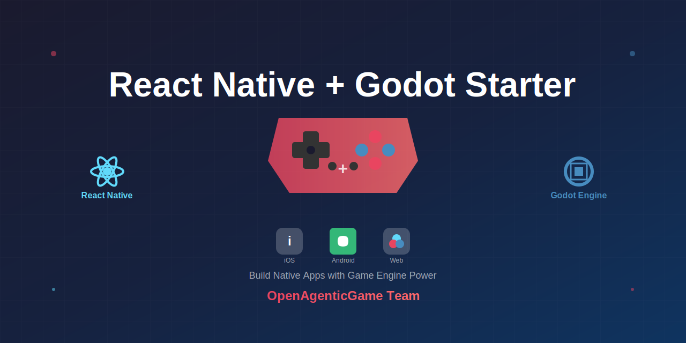

<h1 align="center"></h1>

🎮 **Game Starter** - OpenAgenticGame Team - 基于 🚀 Start UI <small>[native]</small> 的游戏开发模板

## 🌐 Language / 语言

- 🇬🇧 [English](./README-EN.md)
- 🇨🇳 [中文](./README-ZH.md)

---

This project is a new game development template built on [BearStudio Team](https://www.bearstudio.fr/team)'s Start UI Native, integrated with the [Godot Engine](https://godotengine.org/).

本项目是在 [BearStudio Team](https://www.bearstudio.fr/team) 的 Start UI Native 基础上集成了 [Godot 引擎](https://godotengine.org/)，打造了一个全新的游戏开发模板。

## 📦 项目结构

```
项目根目录/
├── src/                      # React Native 应用代码
│   ├── app/                 # Expo Router 页面
│   ├── lib/                 # 工具库
│   │   └── hey-api/         # HeyAPI 自动生成的 API 客户端
│   └── features/            # 功能模块
├── backend/                  # Cloudflare Pages Functions 后端
│   ├── functions/           # API 端点
│   │   ├── api/
│   │   │   ├── users.js
│   │   │   ├── books.js
│   │   │   ├── characters.js
│   │   │   ├── story.js
│   │   │   └── openapi/
│   │   │       └── schema.js  # OpenAPI Schema
│   ├── migrations/          # D1 数据库迁移
│   ├── wrangler.toml        # Cloudflare 配置
│   └── D1_SETUP.md          # D1 数据库设置指南
├── plugin/                   # 自定义 Expo 插件
├── assets/                   # Godot 资源文件
└── ref/                      # 参考文档
```

## 🗄️ 后端服务

项目包含完整的 Cloudflare Pages Functions 后端，提供：

- ✅ **API 端点**: 用户、书籍、角色、故事生成
- ✅ **OpenAPI Schema**: 自动生成类型安全的 API 客户端
- ✅ **D1 数据库**: Cloudflare SQLite 数据库
- ✅ **KV 存储**: 用于缓存（可选）

详细文档请查看：
- [后端 README](./backend/README.md)
- [D1 数据库设置](./backend/D1_SETUP.md)
- [Cloudflare + HeyAPI 集成指南](./CLOUDFLARE_HEYAPI_GUIDE.md)

## 🎮 Godot 引擎集成

### Why（为什么集成 Godot）

**核心信念**：游戏不应该只是简单的触摸交互，而应该提供沉浸式的、富有表现力的游戏体验。

**解决的问题**：
- 传统 React Native 应用难以实现复杂的游戏逻辑和视觉效果
- 游戏开发需要专业的引擎支持（物理系统、动画、粒子效果等）
- 原生游戏开发门槛高，难以与 React Native 应用无缝集成

**价值主张**：通过集成 Godot 引擎，我们可以在 React Native 应用中直接使用专业的游戏开发能力，打造真正有趣的游戏体验。

### How（如何实现）

**技术方案**：
- 使用 [@borndotcom/react-native-godot](https://github.com/borndotcom/react-native-godot) 库将 Godot 引擎嵌入 React Native
- 自定义 Expo 插件自动处理平台特定的资源文件（iOS 的 .pck，Android 的文件夹结构）
- 使用 Worklet 机制实现线程安全的 Godot API 调用
- 通过 React Native UI 层提供自定义控制按钮，与 Godot 场景交互

**实现细节**：
- **iOS**: 将 `main.pck` 文件复制到 iOS 项目根目录，并添加到 Xcode 资源
- **Android**: 将游戏文件递归复制到 `android/app/src/main/assets/` 目录
- **线程安全**: 使用 `runOnGodotThread` 在 Godot 专用线程上执行 API 调用
- **输入控制**: 通过 React Native 的 TouchableOpacity 发送输入动作到 Godot

### What（我们提供什么）

**核心能力**：
- ✅ **2D/3D 游戏开发**: 使用 Godot 强大的游戏引擎创建 2D 或 3D 游戏
- ✅ **物理系统**: 内置物理引擎，支持碰撞检测、刚体模拟
- ✅ **动画系统**: 骨骼动画、精灵动画、粒子效果
- ✅ **混合架构**: 在同一应用中同时拥有 React Native UI 和 Godot 游戏场景
- ✅ **跨平台**: 同时支持 iOS 和 Android 平台
- ✅ **线程安全**: 通过 Worklet 机制确保 API 调用的线程安全

**集成示例**：
```typescript
// 初始化 Godot
await RTNGodot.init({
  '--main-pack': 'main.pck', // iOS
  // 或
  '--path': '/main', // Android
});

// 在 Godot 线程上执行 API 调用
runOnGodotThread(() => {
  'worklet';
  const Godot = RTNGodot.API();
  const Input = Godot.Input;
  Input.action_press('ui_left');
});
```

**详细文档**：
- [Godot 集成指南](./GODOT_INTEGRATION.md) - 完整的集成步骤和最佳实践
